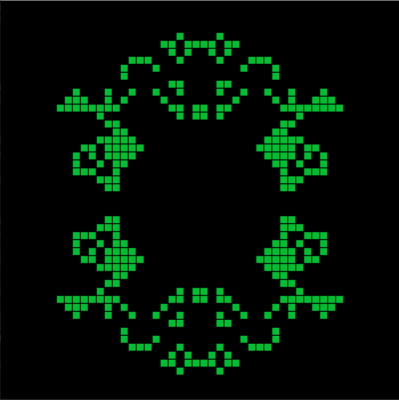

# Game of life

Me realization of popular cellular automaton named "Game of life".

To try it:
1. Clone repo https://github.com/AndreSamusenko/gameOfLife
2. `pip install -r requirements.txt` in current project folder
3. run game.py `python src/game.py`

Now here are a couple of random start configurations.

